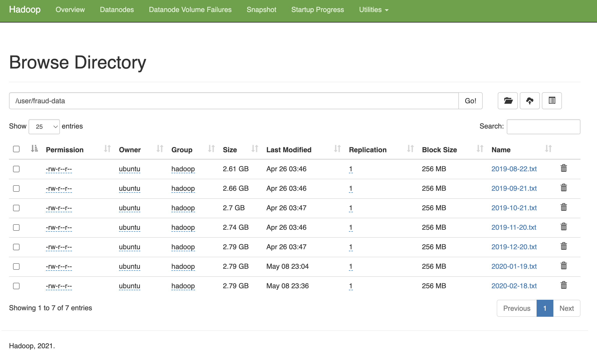

# Скрипт обработки данных

[preprocess.py](scripts/preprocess.py)

Алгоритм:
- Получить список файлов, доступных на hdfs
- Прочитать их в один dataframe
- Извлечь признаки
- Сохранить получаенный датасет в `.parquet` файл

# DAG запуска задачи

[preprocess_data.py](dags/preprocess_data.py)

# Пример логов выполнения задачи

```
Log Type: directory.info

Log Upload Time: Tue May 09 00:27:06 +0000 2023

Log Length: 5181

Showing 4096 bytes of 5181 total. Click here for the full log.

   720 -r-x------   1 yarn     hadoop     734187 May  9 00:18 ./pyspark.zip
  1049335      4 -rwx------   1 yarn     hadoop        710 May  9 00:18 ./default_container_executor.sh
  1049318     44 -r-x------   1 yarn     hadoop      41587 May  9 00:18 ./py4j-0.10.9-src.zip
  1049332      4 -rw-r--r--   1 yarn     hadoop         64 May  9 00:18 ./.launch_container.sh.crc
  1049336      4 -rw-r--r--   1 yarn     hadoop         16 May  9 00:18 ./.default_container_executor.sh.crc
  1049329      4 -rw-r--r--   1 yarn     hadoop         74 May  9 00:18 ./container_tokens
  1048947      4 drwx------   3 yarn     hadoop       4096 May  9 00:18 ./__spark_conf__
  1048950     16 -r-x------   1 yarn     hadoop      14869 May  9 00:18 ./__spark_conf__/log4j.properties
  1048951      4 drwx------   2 yarn     hadoop       4096 May  9 00:18 ./__spark_conf__/__hadoop_conf__
  1049179      4 -r-x------   1 yarn     hadoop       1436 May  9 00:18 ./__spark_conf__/__hadoop_conf__/hdfs-site.xml
  1049173      4 -r-x------   1 yarn     hadoop       1335 May  9 00:18 ./__spark_conf__/__hadoop_conf__/configuration.xsl
  1049199      4 -r-x------   1 yarn     hadoop       2697 May  9 00:18 ./__spark_conf__/__hadoop_conf__/ssl-server.xml.example
  1048961     16 -r-x------   1 yarn     hadoop      14869 May  9 00:18 ./__spark_conf__/__hadoop_conf__/log4j.properties
  1049159      4 -r-x------   1 yarn     hadoop         10 May  9 00:18 ./__spark_conf__/__hadoop_conf__/workers
  1049172     12 -r-x------   1 yarn     hadoop       8925 May  9 00:18 ./__spark_conf__/__hadoop_conf__/capacity-scheduler.xml
  1049191      4 -r-x------   1 yarn     hadoop       1940 May  9 00:18 ./__spark_conf__/__hadoop_conf__/container-executor.cfg
  1049198     12 -r-x------   1 yarn     hadoop      11392 May  9 00:18 ./__spark_conf__/__hadoop_conf__/hadoop-policy.xml
  1049280      8 -r-x------   1 yarn     hadoop       4113 May  9 00:18 ./__spark_conf__/__hadoop_conf__/mapred-queues.xml.template
  1048962      4 -r-x------   1 yarn     hadoop       3321 May  9 00:18 ./__spark_conf__/__hadoop_conf__/hadoop-metrics2.properties
  1048953     20 -r-x------   1 yarn     hadoop      16874 May  9 00:18 ./__spark_conf__/__hadoop_conf__/hadoop-env.sh
  1048963      0 -r-x------   1 yarn     hadoop          0 May  9 00:18 ./__spark_conf__/__hadoop_conf__/yarn-nodes.exclude
  1049197      4 -r-x------   1 yarn     hadoop       2316 May  9 00:18 ./__spark_conf__/__hadoop_conf__/ssl-client.xml.example
  1049171      4 -r-x------   1 yarn     hadoop       1390 May  9 00:18 ./__spark_conf__/__hadoop_conf__/core-site.xml
  1049196      4 -r-x------   1 yarn     hadoop       2069 May  9 00:18 ./__spark_conf__/__hadoop_conf__/mapred-env.sh
  1049115      0 -r-x------   1 yarn     hadoop          0 May  9 00:18 ./__spark_conf__/__hadoop_conf__/dfs.exclude
  1049174      8 -r-x------   1 yarn     hadoop       6995 May  9 00:18 ./__spark_conf__/__hadoop_conf__/yarn-env.sh
  1048969      8 -r-x------   1 yarn     hadoop       4369 May  9 00:18 ./__spark_conf__/__hadoop_conf__/yarn-site.xml
  1048952      4 -r-x------   1 yarn     hadoop       3017 May  9 00:18 ./__spark_conf__/__hadoop_conf__/mapred-site.xml
  1049281    200 -r-x------   1 yarn     hadoop     201136 May  9 00:18 ./__spark_conf__/__spark_hadoop_conf__.xml
  1049312      4 -r-x------   1 yarn     hadoop       1932 May  9 00:18 ./__spark_conf__/__spark_conf__.properties
  1049313      4 -r-x------   1 yarn     hadoop        721 May  9 00:18 ./__spark_conf__/__spark_dist_cache__.properties
  1049315      8 -r-x------   1 yarn     hadoop       5329 May  9 00:18 ./preprocess.py
  1049334      4 -rw-r--r--   1 yarn     hadoop         16 May  9 00:18 ./.default_container_executor_session.sh.crc
  1049328      4 drwx--x---   2 yarn     hadoop       4096 May  9 00:18 ./tmp
  1049333      4 -rwx------   1 yarn     hadoop        655 May  9 00:18 ./default_container_executor_session.sh
  1049331      8 -rwx------   1 yarn     hadoop       6732 May  9 00:18 ./launch_container.sh
broken symlinks(find -L . -maxdepth 5 -type l -ls):

Log Type: launch_container.sh

Log Upload Time: Tue May 09 00:27:06 +0000 2023

Log Length: 6732

Showing 4096 bytes of 6732 total. Click here for the full log.

doop/../hadoop-mapreduce/lib/*:/usr/lib/hadoop/../hadoop-mapreduce/.//*:/usr/lib/hadoop/../hadoop-yarn/lib/*:/usr/lib/hadoop/../hadoop-yarn/.//*:/usr/share/java/mysql.jar:/usr/share/java/postgresql-jdbc4.jar:/usr/lib/clickhouse-jdbc-connector/clickhouse-jdbc.jar:/etc/hive/conf:/usr/lib/hive/lib/hive-spark-client.jar"
export CLASSPATH="$PWD:$PWD/__spark_conf__:$PWD/__spark_libs__/*:/usr/lib/spark/jars/*:/usr/lib/spark/external/lib/*:$HADOOP_CONF_DIR:$HADOOP_COMMON_HOME/*:$HADOOP_COMMON_HOME/lib/*:$HADOOP_HDFS_HOME/*:$HADOOP_HDFS_HOME/lib/*:$HADOOP_MAPRED_HOME/*:$HADOOP_MAPRED_HOME/lib/*:$HADOOP_YARN_HOME/*:$HADOOP_YARN_HOME/lib/*:/usr/lib/spark/yarn/lib/datanucleus-api-jdo.jar:/usr/lib/spark/yarn/lib/datanucleus-core.jar:/usr/lib/spark/yarn/lib/datanucleus-rdbms.jar:$HADOOP_MAPRED_HOME/share/hadoop/mapreduce/*:$HADOOP_MAPRED_HOME/share/hadoop/mapreduce/lib/*:/etc/hadoop/conf:/usr/lib/hadoop/lib/*:/usr/lib/hadoop/.//*:/usr/lib/hadoop/../hadoop-hdfs/./:/usr/lib/hadoop/../hadoop-hdfs/lib/*:/usr/lib/hadoop/../hadoop-hdfs/.//*:/usr/lib/hadoop/../hadoop-mapreduce/lib/*:/usr/lib/hadoop/../hadoop-mapreduce/.//*:/usr/lib/hadoop/../hadoop-yarn/lib/*:/usr/lib/hadoop/../hadoop-yarn/.//*:/usr/share/java/mysql.jar:/usr/share/java/postgresql-jdbc4.jar:/usr/lib/clickhouse-jdbc-connector/clickhouse-jdbc.jar:/etc/hive/conf:/usr/lib/hive/lib/hive-spark-client.jar:$PWD/__spark_conf__/__hadoop_conf__"
export SPARK_USER="airflow"
export SPARK_PUBLIC_DNS="$(hostname -f)"
echo "Setting up job resources"
ln -sf -- "/hadoop/yarn/nm-local-dir/usercache/airflow/filecache/43/py4j-0.10.9-src.zip" "py4j-0.10.9-src.zip"
ln -sf -- "/hadoop/yarn/nm-local-dir/usercache/airflow/filecache/41/__spark_conf__.zip" "__spark_conf__"
ln -sf -- "/hadoop/yarn/nm-local-dir/usercache/airflow/filecache/42/preprocess.py" "preprocess.py"
ln -sf -- "/hadoop/yarn/nm-local-dir/usercache/airflow/filecache/40/pyspark.zip" "pyspark.zip"
echo "Copying debugging information"
# Creating copy of launch script
cp "launch_container.sh" "/var/log/hadoop-yarn/containers/application_1683585844511_0011/container_1683585844511_0011_01_000001/launch_container.sh"
chmod 640 "/var/log/hadoop-yarn/containers/application_1683585844511_0011/container_1683585844511_0011_01_000001/launch_container.sh"
# Determining directory contents
echo "ls -l:" 1>"/var/log/hadoop-yarn/containers/application_1683585844511_0011/container_1683585844511_0011_01_000001/directory.info"
ls -l 1>>"/var/log/hadoop-yarn/containers/application_1683585844511_0011/container_1683585844511_0011_01_000001/directory.info"
echo "find -L . -maxdepth 5 -ls:" 1>>"/var/log/hadoop-yarn/containers/application_1683585844511_0011/container_1683585844511_0011_01_000001/directory.info"
find -L . -maxdepth 5 -ls 1>>"/var/log/hadoop-yarn/containers/application_1683585844511_0011/container_1683585844511_0011_01_000001/directory.info"
echo "broken symlinks(find -L . -maxdepth 5 -type l -ls):" 1>>"/var/log/hadoop-yarn/containers/application_1683585844511_0011/container_1683585844511_0011_01_000001/directory.info"
find -L . -maxdepth 5 -type l -ls 1>>"/var/log/hadoop-yarn/containers/application_1683585844511_0011/container_1683585844511_0011_01_000001/directory.info"
echo "Launching container"
exec /bin/bash -c "$JAVA_HOME/bin/java -server -Xmx3072m -Djava.io.tmpdir=$PWD/tmp '-XX:+UseConcMarkSweepGC' '-XX:CMSInitiatingOccupancyFraction=70' '-XX:MaxHeapFreeRatio=70' '-XX:+CMSClassUnloadingEnabled' '-XX:OnOutOfMemoryError=kill -9 %p' -Dspark.yarn.app.container.log.dir=/var/log/hadoop-yarn/containers/application_1683585844511_0011/container_1683585844511_0011_01_000001 org.apache.spark.deploy.yarn.ApplicationMaster --class 'org.apache.spark.deploy.PythonRunner' --primary-py-file preprocess.py --properties-file $PWD/__spark_conf__/__spark_conf__.properties --dist-cache-conf $PWD/__spark_conf__/__spark_dist_cache__.properties 1> /var/log/hadoop-yarn/containers/application_1683585844511_0011/container_1683585844511_0011_01_000001/stdout 2> /var/log/hadoop-yarn/containers/application_1683585844511_0011/container_1683585844511_0011_01_000001/stderr"

Log Type: prelaunch.err

Log Upload Time: Tue May 09 00:27:06 +0000 2023

Log Length: 0


Log Type: prelaunch.out

Log Upload Time: Tue May 09 00:27:06 +0000 2023

Log Length: 100

Setting up env variables
Setting up job resources
Copying debugging information
Launching container

Log Type: stderr

Log Upload Time: Tue May 09 00:27:06 +0000 2023

Log Length: 286609

Showing 4096 bytes of 286609 total. Click here for the full log.

askSetManager: Finished task 40.0 in stage 14.0 (TID 306) in 33053 ms on rc1a-dataproc-d-lk0d2ljhrp4rd2lh.mdb.yandexcloud.net (executor 2) (39/43)
2023-05-09 00:26:55,203 INFO yarn.YarnAllocator: Driver requested a total number of 2 executor(s).
2023-05-09 00:26:57,419 INFO scheduler.TaskSetManager: Finished task 22.0 in stage 14.0 (TID 300) in 44369 ms on rc1a-dataproc-d-dh4vhyjil8dczyq8.mdb.yandexcloud.net (executor 1) (40/43)
2023-05-09 00:26:57,928 INFO scheduler.TaskSetManager: Finished task 23.0 in stage 14.0 (TID 301) in 44467 ms on rc1a-dataproc-d-dh4vhyjil8dczyq8.mdb.yandexcloud.net (executor 1) (41/43)
2023-05-09 00:26:58,007 INFO yarn.YarnAllocator: Driver requested a total number of 1 executor(s).
2023-05-09 00:27:02,423 INFO scheduler.TaskSetManager: Finished task 32.0 in stage 14.0 (TID 304) in 41483 ms on rc1a-dataproc-d-dh4vhyjil8dczyq8.mdb.yandexcloud.net (executor 5) (42/43)
2023-05-09 00:27:03,397 INFO scheduler.TaskSetManager: Finished task 33.0 in stage 14.0 (TID 305) in 42431 ms on rc1a-dataproc-d-dh4vhyjil8dczyq8.mdb.yandexcloud.net (executor 5) (43/43)
2023-05-09 00:27:03,398 INFO cluster.YarnClusterScheduler: Removed TaskSet 14.0, whose tasks have all completed, from pool 
2023-05-09 00:27:03,398 INFO scheduler.DAGScheduler: ResultStage 14 (parquet at NativeMethodAccessorImpl.java:0) finished in 187.769 s
2023-05-09 00:27:03,398 INFO scheduler.DAGScheduler: Job 8 is finished. Cancelling potential speculative or zombie tasks for this job
2023-05-09 00:27:03,398 INFO cluster.YarnClusterScheduler: Killing all running tasks in stage 14: Stage finished
2023-05-09 00:27:03,398 INFO scheduler.DAGScheduler: Job 8 finished: parquet at NativeMethodAccessorImpl.java:0, took 187.773524 s
2023-05-09 00:27:04,073 INFO datasources.FileFormatWriter: Write Job 6dd8f382-507b-4e5d-a120-4b06e8763d99 committed.
2023-05-09 00:27:04,076 INFO datasources.FileFormatWriter: Finished processing stats for write job 6dd8f382-507b-4e5d-a120-4b06e8763d99.
2023-05-09 00:27:04,096 INFO server.AbstractConnector: Stopped Spark@8951564{HTTP/1.1, (http/1.1)}{0.0.0.0:0}
2023-05-09 00:27:04,097 INFO ui.SparkUI: Stopped Spark web UI at https://ui-c9qjau3ngq751pn319kj-rc1a-dataproc-d-z0yd5afwm95l4mgo-40927.dataproc-ui.yandexcloud.net
2023-05-09 00:27:04,100 INFO yarn.YarnAllocator: Driver requested a total number of 0 executor(s).
2023-05-09 00:27:04,101 INFO cluster.YarnClusterSchedulerBackend: Shutting down all executors
2023-05-09 00:27:04,101 INFO cluster.YarnSchedulerBackend$YarnDriverEndpoint: Asking each executor to shut down
2023-05-09 00:27:04,132 INFO spark.MapOutputTrackerMasterEndpoint: MapOutputTrackerMasterEndpoint stopped!
2023-05-09 00:27:04,143 INFO memory.MemoryStore: MemoryStore cleared
2023-05-09 00:27:04,143 INFO storage.BlockManager: BlockManager stopped
2023-05-09 00:27:04,144 INFO storage.BlockManagerMaster: BlockManagerMaster stopped
2023-05-09 00:27:04,146 INFO scheduler.OutputCommitCoordinator$OutputCommitCoordinatorEndpoint: OutputCommitCoordinator stopped!
2023-05-09 00:27:04,151 INFO spark.SparkContext: Successfully stopped SparkContext
2023-05-09 00:27:04,433 INFO yarn.ApplicationMaster: Final app status: SUCCEEDED, exitCode: 0
2023-05-09 00:27:04,436 INFO yarn.ApplicationMaster: Unregistering ApplicationMaster with SUCCEEDED
2023-05-09 00:27:04,441 INFO impl.AMRMClientImpl: Waiting for application to be successfully unregistered.
2023-05-09 00:27:04,543 INFO yarn.ApplicationMaster: Deleting staging directory hdfs:https://ui-c9qjau3ngq751pn319kj-rc1a-dataproc-m-96wxifu2yp7i57ca-.dataproc-ui.yandexcloud.net/user/airflow/.sparkStaging/application_1683585844511_0011
2023-05-09 00:27:04,545 INFO util.ShutdownHookManager: Shutdown hook called
2023-05-09 00:27:04,546 INFO util.ShutdownHookManager: Deleting directory /hadoop/yarn/nm-local-dir/usercache/airflow/appcache/application_1683585844511_0011/spark-74efec32-60bb-4a74-b772-96fef425050b/pyspark-2b875147-24ce-42aa-91d4-3469523d8942
2023-05-09 00:27:04,548 INFO util.ShutdownHookManager: Deleting directory /hadoop/yarn/nm-local-dir/usercache/airflow/appcache/application_1683585844511_0011/spark-74efec32-60bb-4a74-b772-96fef425050b

Log Type: stdout

Log Upload Time: Tue May 09 00:27:06 +0000 2023

Log Length: 5715

Showing 4096 bytes of 5715 total. Click here for the full log.

09|           0|       0|                0|
|             9|2019-08-22 21:09:37|          8|        931|     61.7|          76177|           0|       0|                0|
|            10|2019-08-22 11:32:42|         10|        663|    40.71|          41562|           0|       1|                2|
|            11|2019-08-22 03:09:26|         10|        770|    63.91|          11366|           0|       0|                0|
|            12|2019-08-22 15:47:54|         10|          0|    58.89|          56874|           0|       0|                0|
|            13|2019-08-22 21:59:20|         10|        649|    89.24|          79160|           0|       0|                0|
|            14|2019-08-22 20:55:13|         11|        380|     9.89|          75313|           0|       0|                0|
|            15|2019-08-22 16:39:03|         11|        337|    83.36|          59943|           0|       0|                0|
|            16|2019-08-22 23:15:07|         11|        973|    35.12|          83707|           0|       0|                0|
|            17|2019-08-22 07:39:45|         12|          9|     74.0|          27585|           0|       0|                0|
|            18|2019-08-22 05:35:39|         12|        745|   108.63|          20139|           0|       0|                0|
|            19|2019-08-22 10:29:16|         12|          9|    84.45|          37756|           0|       0|                0|
+--------------+-------------------+-----------+-----------+---------+---------------+------------+--------+-----------------+
only showing top 20 rows

Row count: 93983004
Count of NaN values in each column:
+--------------+-----------+-----------+-----------+---------+---------------+------------+--------+-----------------+
|transaction_id|tx_datetime|customer_id|terminal_id|tx_amount|tx_time_seconds|tx_time_days|tx_fraud|tx_fraud_scenario|
+--------------+-----------+-----------+-----------+---------+---------------+------------+--------+-----------------+
|             0|          0|          0|          0|        0|              0|           0|       0|                0|
+--------------+-----------+-----------+-----------+---------+---------------+------------+--------+-----------------+

+----+-----+-----------------------------------------------------+--------+
|year|month|features                                             |tx_fraud|
+----+-----+-----------------------------------------------------+--------+
|2019|8    |(35,[11,27,33,34],[1.0,1.0,1.0,0.4039623040681563])  |0       |
|2019|8    |(35,[13,27,33,34],[1.0,1.0,1.0,0.8797411798419403])  |0       |
|2019|8    |(35,[15,27,33,34],[1.0,1.0,1.0,-0.4567517211987758]) |0       |
|2019|8    |(35,[8,27,33,34],[1.0,1.0,1.0,0.6340997439791007])   |0       |
|2019|8    |(35,[4,27,33,34],[1.0,1.0,1.0,1.1772241021689296])   |0       |
|2019|8    |(35,[12,27,33,34],[1.0,1.0,1.0,-0.48533721373508254])|0       |
|2019|8    |(35,[16,27,33,34],[1.0,1.0,1.0,-0.1704122959622112]) |0       |
|2019|8    |(35,[20,27,33,34],[1.0,1.0,1.0,2.062889870920943])   |0       |
|2019|8    |(35,[10,27,33,34],[1.0,1.0,1.0,0.7995564507782323])  |0       |
|2019|8    |(35,[18,27,33,34],[1.0,1.0,1.0,0.1808501123229145])  |0       |
|2019|8    |(35,[1,27,33,34],[1.0,1.0,1.0,-0.32763250491189855]) |1       |
|2019|8    |(35,[16,27,33,34],[1.0,1.0,1.0,0.2343873483443025])  |0       |
|2019|8    |(35,[6,27,33,34],[1.0,1.0,1.0,0.11277788009662458])  |0       |
|2019|8    |(35,[18,27,33,34],[1.0,1.0,1.0,0.8480064381279049])  |0       |
|2019|8    |(35,[17,27,33,34],[1.0,1.0,1.0,-1.074246809970352])  |0       |
|2019|8    |(35,[9,27,33,34],[1.0,1.0,1.0,0.7055634753198677])   |0       |
|2019|8    |(35,[22,27,33,34],[1.0,1.0,1.0,-0.4630502195542333]) |0       |
|2019|8    |(35,[8,27,33,34],[1.0,1.0,1.0,0.4788175345234004])   |0       |
|2019|8    |(35,[13,27,33,34],[1.0,1.0,1.0,1.3177290654829799])  |0       |
|2019|8    |(35,[3,27,33,34],[1.0,1.0,1.0,0.7319687184254393])   |0       |
+----+-----+-----------------------------------------------------+--------+
only showing top 20 rows
```

# Снимок экрана с сохраненным parquet файлом

 