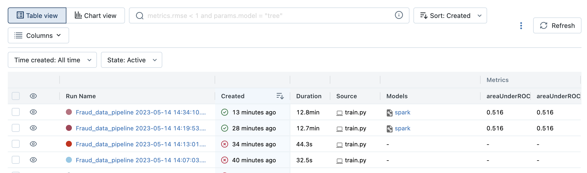
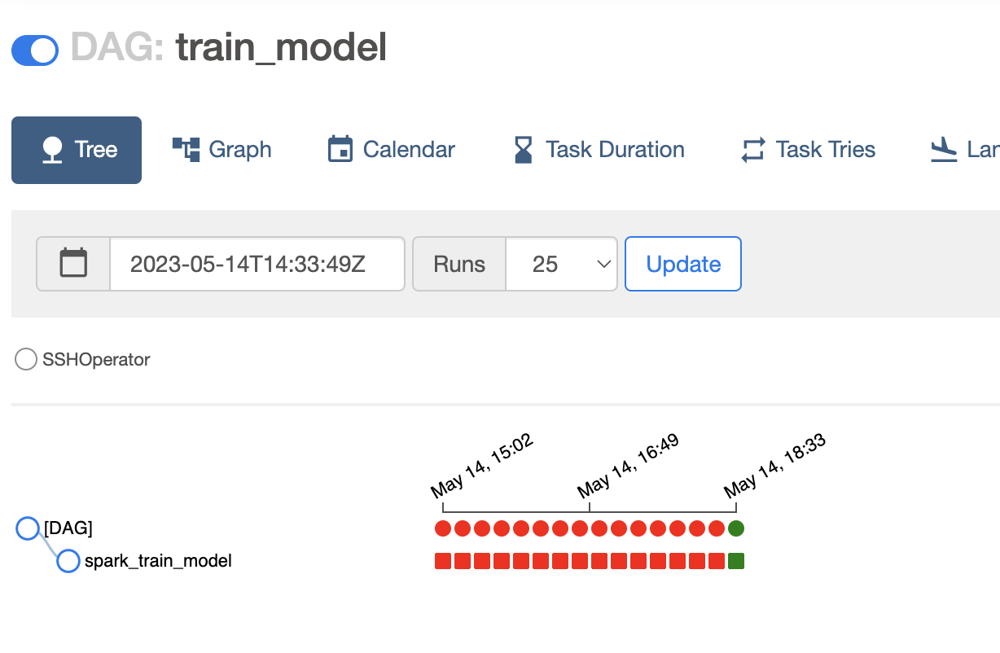

# Настройка

На Dataproc мастер узле:
```
sudo /opt/conda/bin/conda install -c conda-forge mlflow-skinny
```

Добавить в /etc/environment:
```
AWS_ACCESS_KEY_ID="<access key id>"
AWS_SECRET_ACCESS_KEY="<access key>"
MLFLOW_S3_ENDPOINT_URL="https://storage.yandexcloud.net"
MLFLOW_TRACKING_URI="http://10.128.0.39:5000"
AWS_DEFAULT_REGION="ru-central1"
```

Развернуть отдельную виртуальную машину для mlflow. На ней развернуть [mlflow-сревер](https://github.com/Toumash/mlflow-docker). Вместо minio настроить доступ к s3 на yandex cloud.


# Скрипт обучения модели

[train.py](scripts/train.py)

Модель и метрики сохраняются в mlflow.

# DAG запуска скрипта обучения модели

[train_model_dag.py](dags/train_model_dag.py)

# Результаты выполнения DAG airflow


