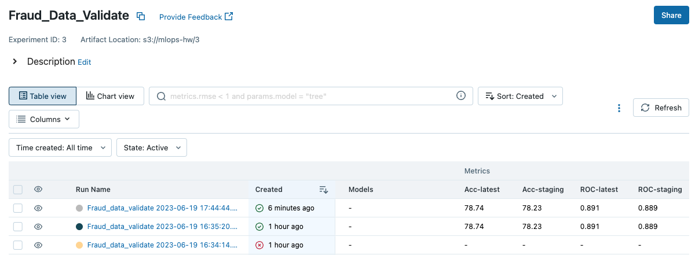
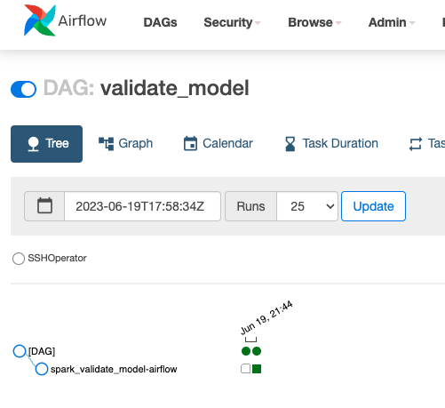

# Автоматическая валидация

## Цель

В этом ДЗ вы научитесь проводить валидацию модели после обучения и ее анализ.

## Описание/Пошаговая инструкция выполнения домашнего задания

1. Выберите стратегию для валидации модели.
2. Оцените метрики модели на выбранной стратегии.
3. Подготовьте новую модель и проведите A/B-тестирование на валидации.
4. Добавьте в AirFlow шаг по валидации модели и построению отчета.

## Валидация модели

Для валидации используются 2 модели:
- Staging модель из mlflow (текущая используемая модель)
- Latest модель из mlflow (последняя обученная модель)

Для каждой модели вычисляются метрики AUC и Accuracy (для fraud транзакций) на самых свежих данных и логгируются в mlflow. Если метрики свежей модели окажутся выше текущей, ее можно переместить в staging в интерфейсе mlflow.

Скрипт валидации (находится на master узле spark кластера): [validate.py](scripts/validate.py)

DAG запуска скрипта обучения модели: [validate_model_dag.py](dags/validate_model_dag.py)

## Результаты работы скрипта валидации в MLFlow

## Результаты выполнения DAG airflow

