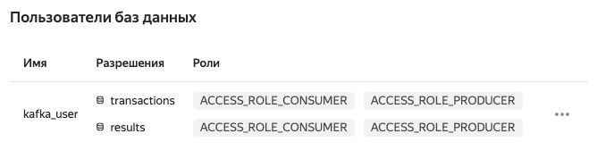

# Асинхронный потоковый режим

## Настройка окружения

### 1. Настройить kafka на YC

- Создать Managed Service for Kafka кластер
- Создать в нем топики transactions and results
- Создать пользователя и разрешить ему запись и чтение из указанных топиков 

### 2. Установить необходимые библиотеки на spark-кластер (yandex dataproc)

#### Вариант 1

Скачиваем на каждую ноду кластера все необходимые jar'ники и кладем их в /usr/lib/spark/jars:
```
sudo su
cd /usr/lib/spark/jars
wget https://repo1.maven.org/maven2/org/apache/spark/spark-sql-kafka-0-10_2.12/3.0.2/spark-sql-kafka-0-10_2.12-3.0.2.jar
wget https://repo1.maven.org/maven2/org/apache/kafka/kafka-clients/2.8.1/kafka-clients-2.8.1.jar
wget https://repo1.maven.org/maven2/org/apache/commons/commons-pool2/2.11.1/commons-pool2-2.11.1.jar
wget https://repo1.maven.org/maven2/org/apache/spark/spark-token-provider-kafka-0-10_2.12/3.0.2/spark-token-provider-kafka-0-10_2.12-3.0.2.jar
```
Далее в зависимости от типа ноды systemctl restart hadoop-yarn@resourcemanager.service или systemctl restart hadoop-yarn@nodemanager.service.

#### Вариант 2

По ссылке доступен рецепт для лечения проблемы, которая мешает работать с Kafka: https://github.com/zinal/yc-dataproc-snippets/tree/main/dataproc-kafka"

### 3. Установить необходимые сертификаты на spark-кластер

На каждом узле spark-кластера:
```
# Скачать сертификат
sudo mkdir --parents /usr/local/share/ca-certificates/Yandex/ && \
sudo wget "https://storage.yandexcloud.net/cloud-certs/CA.pem" \
    --output-document /usr/local/share/ca-certificates/Yandex/YandexInternalRootCA.crt && \
sudo chmod 655 /usr/local/share/ca-certificates/Yandex/YandexInternalRootCA.crt

# Добавить сертификат в харанилище Java Key Store
cd /etc/security
sudo keytool -importcert \
            -alias YandexCA -file /usr/local/share/ca-certificates/Yandex/YandexInternalRootCA.crt \
            -keystore ssl -storepass <password>\
            --noprompt
```

## Скрипты генерации и обработки данных

Скрипт генерации аднных из spark-окружения: [generate_streaming_data.py](scripts/generate_streaming_data.py).
Данный скрипт сэмлирует небольшой набор данных из parquet датафрейма и пишет его в топик transactions.
Запуск скрипта:
```
spark-submit --master yarn --deploy-mode client /home/ubuntu/generate_streaming_data.py
```

Скрипт обработки потоковых данных: [spark_streaming.py](scripts/spark_streaming.py).
Внутри скрипта можно настроить, куда будут направляться обработанные данные: либо на консоль, либо в топик results.
Запуск скрипта:
```
spark-submit --master yarn --deploy-mode client /home/ubuntu/spark_streaming.py
```

Скрипт чтения топика results (можно запустить на локальной машине):  [kafka_consumer.py](scripts/kafka_consumer.py).
Запуск скрипта:
```
./kafka_consumer.py -b rc1a-ifa7kf257ig8r7cm.mdb.yandexcloud.net:9091 -u kafka_user -p kafka_user -t results -g group_name
```

## Обработка данных с выводом в консоль

### Генерация
```
ubuntu@rc1a-dataproc-m-96wxifu2yp7i57ca:~$ spark-submit --master yarn --deploy-mode client /home/ubuntu/spark_streaming.py

....

+---------+--------------------+
|      key|               value|
+---------+--------------------+
|125660845|{"transaction_id"...|
|125376939|{"transaction_id"...|
|125898887|{"transaction_id"...|
|125943645|{"transaction_id"...|
|126352815|{"transaction_id"...|
|126046117|{"transaction_id"...|
|126458769|{"transaction_id"...|

ubuntu@rc1a-dataproc-m-96wxifu2yp7i57ca:~$ 

```

### Обработка

```
ubuntu@rc1a-dataproc-m-96wxifu2yp7i57ca:~$ spark-submit --master yarn --deploy-mode client /home/ubuntu/spark_streaming.py

...

 |-- transaction_id: integer (nullable = true)
 |-- ts: timestamp (nullable = true)
 |-- tx_amount: double (nullable = true)
 |-- is_weekend: integer (nullable = true)
 |-- is_night: integer (nullable = true)
 |-- customer_id_nb_tx_1day_window: integer (nullable = true)
 |-- customer_id_avg_amount_1day_window: double (nullable = true)
 |-- customer_id_nb_tx_7day_window: integer (nullable = true)
 |-- customer_id_avg_amount_7day_window: double (nullable = true)
 |-- customer_id_nb_tx_30day_window: integer (nullable = true)
 |-- customer_id_avg_amount_30day_window: double (nullable = true)
 |-- terminal_id_nb_tx_1day_window: integer (nullable = true)
 |-- terminal_id_risk_1day_window: double (nullable = true)
 |-- terminal_id_nb_tx_7day_window: integer (nullable = true)
 |-- terminal_id_risk_7day_window: double (nullable = true)
 |-- terminal_id_nb_tx_30day_window: integer (nullable = true)
 |-- terminal_id_risk_30day_window: double (nullable = true)
 |-- tx_fraud: integer (nullable = true)

-------------------------------------------
Batch: 0
-------------------------------------------
+--------------+---+--------+-----------+----------+
|transaction_id| ts|tx_fraud|probability|prediction|
+--------------+---+--------+-----------+----------+
+--------------+---+--------+-----------+----------+

...

-------------------------------------------
Batch: 1
-------------------------------------------
+--------------+-------------------+--------+--------------------+----------+
|transaction_id|                 ts|tx_fraud|         probability|prediction|
+--------------+-------------------+--------+--------------------+----------+
|     125898887|2019-11-10 13:40:38|       0|[0.98206405209620...|       0.0|
|     125943645|2019-11-10 12:01:49|       0|[0.98194446454342...|       0.0|
|     126352815|2019-11-10 18:46:52|       0|[0.98206405209620...|       0.0|
|     125376939|2019-11-10 04:41:21|       0|[0.98958332666476...|       0.0|
|     126046117|2019-11-10 15:15:00|       0|[0.98206405209620...|       0.0|
|     125660845|2019-11-10 13:45:33|       0|[0.98204738897412...|       0.0|
|     126458769|2019-11-10 15:35:00|       1|[0.09424037649061...|       1.0|
+--------------+-------------------+--------+--------------------+----------+


```

## Обработка данных с выводом результатов в топик results

### Генерация
```
ubuntu@rc1a-dataproc-m-96wxifu2yp7i57ca:~$ spark-submit --master yarn --deploy-mode client /home/ubuntu/spark_streaming.py

....

+---------+--------------------+
|      key|               value|
+---------+--------------------+
|125713051|{"transaction_id"...|
|126549745|{"transaction_id"...|
|125874575|{"transaction_id"...|
|125713414|{"transaction_id"...|
|126287209|{"transaction_id"...|
|126632147|{"transaction_id"...|
|126035710|{"transaction_id"...|
|126517130|{"transaction_id"...|
|125452340|{"transaction_id"...|
+---------+--------------------+

ubuntu@rc1a-dataproc-m-96wxifu2yp7i57ca:~$ 

```

### Обработка

В скрипте установить `WRITE_TO_CONSOLE = False`.

```
ubuntu@rc1a-dataproc-m-96wxifu2yp7i57ca:~$ spark-submit --master yarn --deploy-mode client /home/ubuntu/spark_streaming.py

...
```

###  Чтение топика results


```
(mlops) sand1k@Andreys-MacBook-Pro scripts % ./kafka_consumer.py -b rc1a-ifa7kf257ig8r7cm.mdb.yandexcloud.net:9091 -u kafka_user -p kafka_user -t results -g group_name
Waiting for a new messages. Press Ctrl+C to stop

results:1:76: key=b'125713051' value={'transaction_id': 125713051, 'ts': '2019-11-10T14:43:06.000Z', 'tx_fraud': 1, 'probability': {'type': 1, 'values': [0.9819444645434234, 0.018055535456576573]}, 'prediction': 0.0}
results:2:72: key=b'126632147' value={'transaction_id': 126632147, 'ts': '2019-11-10T18:32:41.000Z', 'tx_fraud': 0, 'probability': {'type': 1, 'values': [0.9820640520962041, 0.017935947903795855]}, 'prediction': 0.0}
results:1:77: key=b'125713414' value={'transaction_id': 125713414, 'ts': '2019-11-10T22:09:00.000Z', 'tx_fraud': 0, 'probability': {'type': 1, 'values': [0.9820640520962041, 0.017935947903795855]}, 'prediction': 0.0}
results:2:73: key=b'126517130' value={'transaction_id': 126517130, 'ts': '2019-11-10T09:47:41.000Z', 'tx_fraud': 0, 'probability': {'type': 1, 'values': [0.9820640520962041, 0.017935947903795855]}, 'prediction': 0.0}
results:2:74: key=b'125452340' value={'transaction_id': 125452340, 'ts': '2019-11-10T22:12:41.000Z', 'tx_fraud': 0, 'probability': {'type': 1, 'values': [0.9820640520962041, 0.017935947903795855]}, 'prediction': 0.0}
results:0:59: key=b'126549745' value={'transaction_id': 126549745, 'ts': '2019-11-10T15:51:52.000Z', 'tx_fraud': 0, 'probability': {'type': 1, 'values': [0.9820640520962041, 0.017935947903795855]}, 'prediction': 0.0}
results:0:60: key=b'125874575' value={'transaction_id': 125874575, 'ts': '2019-11-10T05:07:44.000Z', 'tx_fraud': 0, 'probability': {'type': 1, 'values': [0.9820473889741226, 0.01795261102587736]}, 'prediction': 0.0}
results:0:61: key=b'126287209' value={'transaction_id': 126287209, 'ts': '2019-11-10T15:20:14.000Z', 'tx_fraud': 1, 'probability': {'type': 1, 'values': [0.14926939816113577, 0.8507306018388642]}, 'prediction': 1.0}
results:0:62: key=b'126035710' value={'transaction_id': 126035710, 'ts': '2019-11-10T03:57:39.000Z', 'tx_fraud': 0, 'probability': {'type': 1, 'values': [0.9820640520962041, 0.017935947903795855]}, 'prediction': 0.0}

```

