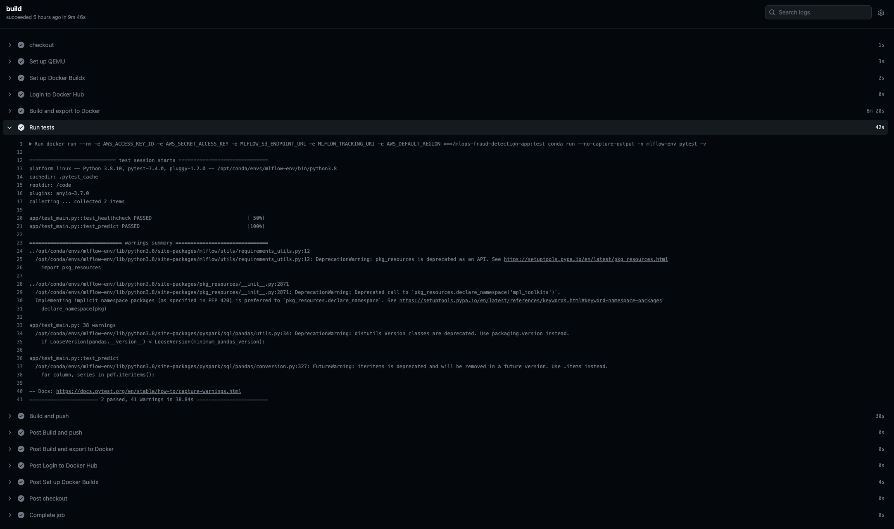
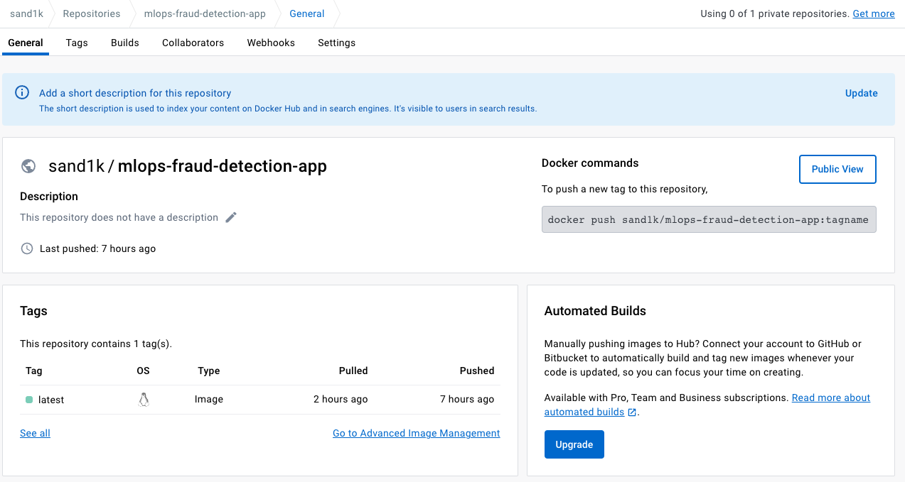
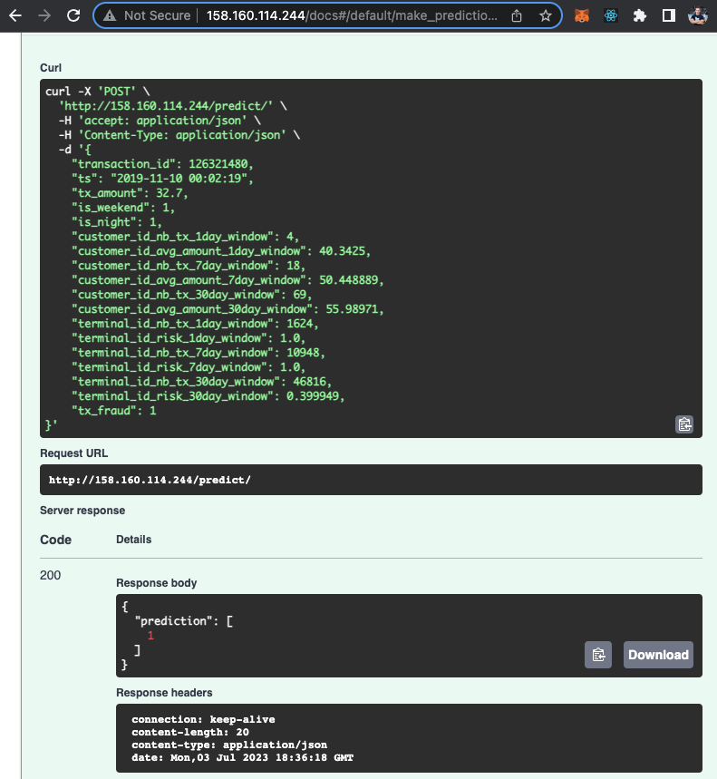

# Обновление моделей

## Описание/Пошаговая инструкция выполнения домашнего задания:

1. Напишите на python REST API для вашей модели.
2. Настройте на github actions CI/CD с тестами, сборкой docker и его публикацией в registry.
3. Создайте k8s манифест для запуска вашего сервиса.
4. Создайте в YC k8s кластер из 3-х узлов.
6. Запустите ваш сервис в k8s и проведите тестирование через публичный API.

## Настройка окружения

Настройка kubernetes:
```
brew install kubectl 
brew install k9s
brew install helm

yc components update
yc managed-kubernetes cluster get-credentials test-k8s-cluster --external

helm repo add ingress-nginx https://kubernetes.github.io/ingress-nginx && \
helm repo update && \
helm install ingress-nginx ingress-nginx/ingress-nginx

kubectl create secret generic mlflow \                                     
    --from-literal=AWS_ACCESS_KEY_ID='<access key>' \
    --from-literal=AWS_SECRET_ACCESS_KEY='<secret key>' \
    --from-literal=MLFLOW_S3_ENDPOINT_URL='https://storage.yandexcloud.net' \
    --from-literal=MLFLOW_TRACKING_URI='http://<mlflow domain>:5000' \
    --from-literal=AWS_DEFAULT_REGION='ru-central1'

kubectl apply -f k8s/fraud-detection-ingress.yml 
kubectl apply -f k8s/fraud-detection-ingress.yml 
kubectl apply -f k8s/fraud-detection-ingress.yml 
```

## Скрипты генерации и обработки данных

Fastapi сервис: [fastapi_app](fastapi_app/).

Dockerfile для запуска fastapi сервиса: [Dockerfile](fastapi_app/Dockerfile).

Сборка и запуск докер контейнера вручную (переменные окружения AWS_ACCESS_KEY_ID, AWS_SECRET_ACCESS_KEY, MLFLOW_S3_ENDPOINT_URL, MLFLOW_TRACKING_URI и AWS_DEFAULT_REGION должны быть настроены в .env файле):
```
cd fastapi_app
docker build -t fraud_detection_img .
docker run --rm --name fraud_detection_container -p 8000:8000 --env-file ../.env fraud_detection_img
```

Запуск тестов:
```
docker exec -it fraud_detection_container bash
conda activate mlflow-env
pytest -v
```
или
```
docker run --rm -e AWS_ACCESS_KEY_ID -e AWS_SECRET_ACCESS_KEY -e MLFLOW_S3_ENDPOINT_URL -e MLFLOW_TRACKING_URI -e AWS_DEFAULT_REGION fraud_detection_img conda run --no-capture-output -n mlflow-env pytest -v
```

Скрипт для генерации запросов к сервису: [generate_requests.py](scripts/generate_requests.py).
Запуск скрипта:
```
python scripts/generate_requests.py
```

Конфигрурационный файл github actions для сборки, тестирования и публикации контейнера: [docker-image.yml](.github/workflows/docker-image.yml).

Конфигурационные файлы kubernetes для запуска сервиса в kubernetes-кластере:
- [fraud-detection-deployment.yml](k8s/fraud-detection-deployment.yml)
- [fraud-detection-servcie.yml](k8s/fraud-detection-service.yml)
- [fraud-detection-ingress.yml](k8s/fraud-detection-ingress.yml)


## Логи/снимки экрана работы сервисов

### Github actions



### Docker registry



### k8s

```
(mlops) sand1k@Andreys-MacBook-Pro otus-mlops % kubectl get pods                                          
NAME                                          READY   STATUS    RESTARTS   AGE
fraud-detection-deployment-74c4c496d7-7g6mh   1/1     Running   0          127m
ingress-nginx-controller-78d54fbd-jbspm       1/1     Running   0          5h12m
ubuntu                                        1/1     Running   0          4h9m

(mlops) sand1k@Andreys-MacBook-Pro otus-mlops % kubectl describe deployment fraud-detection-deployment
Name:                   fraud-detection-deployment
Namespace:              default
CreationTimestamp:      Mon, 03 Jul 2023 17:39:18 +0400
Labels:                 app=fraud-detection
Annotations:            deployment.kubernetes.io/revision: 6
Selector:               app=fraud-detection
Replicas:               1 desired | 1 updated | 1 total | 1 available | 0 unavailable
StrategyType:           RollingUpdate
MinReadySeconds:        0
RollingUpdateStrategy:  25% max unavailable, 25% max surge
Pod Template:
  Labels:       app=fraud-detection
  Annotations:  kubectl.kubernetes.io/restartedAt: 2023-07-03T20:32:33+04:00
  Containers:
   fraud-detection:
    Image:      sand1k/mlops-fraud-detection-app:latest
    Port:       8000/TCP
    Host Port:  0/TCP
    Environment:
      AWS_ACCESS_KEY_ID:       <set to the key 'AWS_ACCESS_KEY_ID' in secret 'mlflow'>       Optional: false
      AWS_SECRET_ACCESS_KEY:   <set to the key 'AWS_SECRET_ACCESS_KEY' in secret 'mlflow'>   Optional: false
      MLFLOW_S3_ENDPOINT_URL:  <set to the key 'MLFLOW_S3_ENDPOINT_URL' in secret 'mlflow'>  Optional: false
      MLFLOW_TRACKING_URI:     <set to the key 'MLFLOW_TRACKING_URI' in secret 'mlflow'>     Optional: false
      AWS_DEFAULT_REGION:      <set to the key 'AWS_DEFAULT_REGION' in secret 'mlflow'>      Optional: false
    Mounts:                    <none>
  Volumes:                     <none>
Conditions:
  Type           Status  Reason
  ----           ------  ------
  Available      True    MinimumReplicasAvailable
  Progressing    True    NewReplicaSetAvailable
OldReplicaSets:  <none>
NewReplicaSet:   fraud-detection-deployment-74c4c496d7 (1/1 replicas created)
Events:          <none>

(mlops) sand1k@Andreys-MacBook-Pro otus-mlops % kubectl describe service fraud-detection-service
Name:              fraud-detection-service
Namespace:         default
Labels:            app=fraud-detection
Annotations:       <none>
Selector:          app=fraud-detection
Type:              ClusterIP
IP Family Policy:  SingleStack
IP Families:       IPv4
IP:                10.96.149.94
IPs:               10.96.149.94
Port:              fraud-detection  8000/TCP
TargetPort:        8000/TCP
Endpoints:         10.112.128.10:8000
Session Affinity:  None
Events:            <none>

(mlops) sand1k@Andreys-MacBook-Pro otus-mlops % kubectl describe ingress fraud-detection-ingress
Name:             fraud-detection-ingress
Labels:           <none>
Namespace:        default
Address:          158.160.114.244
Ingress Class:    <none>
Default backend:  <default>
Rules:
  Host        Path  Backends
  ----        ----  --------
  *           
              /   fraud-detection-service:8000 (10.112.128.10:8000)
Annotations:  kubernetes.io/ingress.class: nginx
Events:       <none>
```

### Served model



Тестирование с помощью скрипта:
```
(mlops) sand1k@Andreys-MacBook-Pro otus-mlops % python scripts/generate_requests.py
===========================================================
transaction_id                                   125638290
tx_datetime                            2019-11-10 00:00:00
customer_id                                         210793
terminal_id                                            938
tx_amount                                            75.11
tx_time_seconds                                    6912000
tx_time_days                                            80
tx_fraud                                                 0
tx_fraud_scenario                                        0
ts                                     2019-11-10 00:00:00
is_weekend                                               1
is_night                                                 1
customer_id_nb_tx_1day_window                            3
customer_id_avg_amount_1day_window               52.773333
customer_id_nb_tx_7day_window                           12
customer_id_avg_amount_7day_window              101.129167
customer_id_nb_tx_30day_window                          49
customer_id_avg_amount_30day_window             104.383469
truncated_ts                                        437040
nb_fraud_delay                                          23
nb_tx_delay                                          15800
nb_fraud_delay_window                                  154
nb_tx_delay_window                                   84057
nb_fraud_window                                        131
terminal_id_nb_tx_1day_window                         2231
terminal_id_risk_1day_window                      0.002241
terminal_id_nb_tx_7day_window                        16047
terminal_id_risk_7day_window                      0.002056
terminal_id_nb_tx_30day_window                       68257
terminal_id_risk_30day_window                     0.001919
Name: 1244786, dtype: object
-----------------------------------------------------------
Prediction: [0.0]
===========================================================
===========================================================
transaction_id                                   126201682
tx_datetime                            2019-11-10 00:00:00
customer_id                                         570527
terminal_id                                            941
tx_amount                                            83.75
tx_time_seconds                                    6912000
tx_time_days                                            80
tx_fraud                                                 0
tx_fraud_scenario                                        0
ts                                     2019-11-10 00:00:00
is_weekend                                               1
is_night                                                 1
customer_id_nb_tx_1day_window                            1
customer_id_avg_amount_1day_window                   83.75
customer_id_nb_tx_7day_window                           18
customer_id_avg_amount_7day_window               55.203333
customer_id_nb_tx_30day_window                          78
customer_id_avg_amount_30day_window              65.282051
truncated_ts                                        437040
nb_fraud_delay                                          13
nb_tx_delay                                          11043
nb_fraud_delay_window                                   93
nb_tx_delay_window                                   58804
nb_fraud_window                                         80
terminal_id_nb_tx_1day_window                         1579
terminal_id_risk_1day_window                      0.002533
terminal_id_nb_tx_7day_window                        11034
terminal_id_risk_7day_window                      0.001813
terminal_id_nb_tx_30day_window                       47761
terminal_id_risk_30day_window                     0.001675
Name: 1268872, dtype: object
-----------------------------------------------------------
Prediction: [0.0]
===========================================================
===========================================================
transaction_id                                   125697428
tx_datetime                            2019-11-10 00:00:00
customer_id                                         248498
terminal_id                                            624
tx_amount                                            13.59
tx_time_seconds                                    6998400
tx_time_days                                            80
tx_fraud                                                 0
tx_fraud_scenario                                        0
ts                                     2019-11-10 00:00:00
is_weekend                                               1
is_night                                                 1
customer_id_nb_tx_1day_window                            2
customer_id_avg_amount_1day_window                  13.105
customer_id_nb_tx_7day_window                           15
customer_id_avg_amount_7day_window                  36.322
customer_id_nb_tx_30day_window                          75
customer_id_avg_amount_30day_window              31.531867
truncated_ts                                        437040
nb_fraud_delay                                          17
nb_tx_delay                                          10803
nb_fraud_delay_window                                  125
nb_tx_delay_window                                   57147
nb_fraud_window                                        108
terminal_id_nb_tx_1day_window                         1517
terminal_id_risk_1day_window                      0.001318
terminal_id_nb_tx_7day_window                        10692
terminal_id_risk_7day_window                      0.002151
terminal_id_nb_tx_30day_window                       46344
terminal_id_risk_30day_window                      0.00233
Name: 1157851, dtype: object
-----------------------------------------------------------
Prediction: [0.0]
===========================================================
```