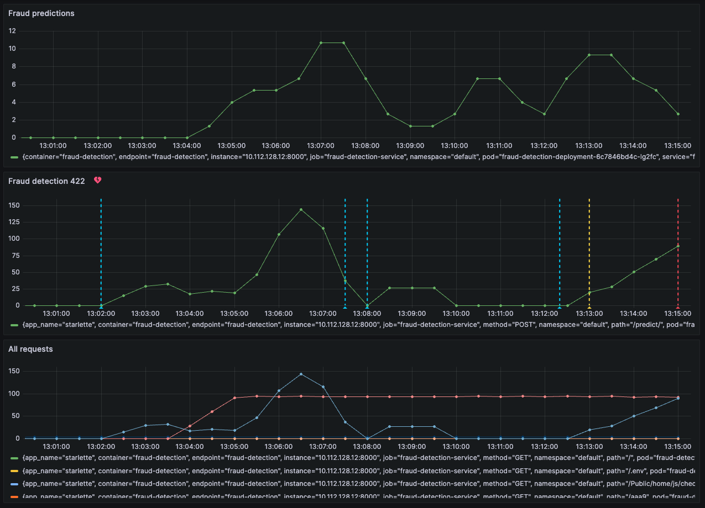

# Алертинг

## Описание/Пошаговая инструкция выполнения домашнего задания

1. Напишите скрипт для генерации данных и инференса через API.
2. Добавьте в веб-сервис генерацию метрик модели для Prometheus.
3. Разверните в k8s prometheus и grafana и добавьте сбор метрик.
4. Настройте в Grafana дашборды и установите срабатывание оповещений.
5. Запустите скрипт для генерации данных и инференса.
6. Убедитесь, что метрики собираются и оповещения отрабатывают.

## Настройка окружения

Настройка kubernetes:
```
helm repo add prometheus-community https://prometheus-community.github.io/helm-charts
helm repo update
helm install my-kube-prometheus-stack prometheus-community/kube-prometheus-stack
kubectl --namespace default get pods -l "release=my-kube-prometheus-stack"
```

Перенаправление портов для доступа к ui prometheus:
```
kubectl port-forward --address 0.0.0.0 svc/my-kube-prometheus-stack-prometheus 9090
```
UI prometheus будет доступен на `localhost:9090`.

Перенаправление портов для доступа к ui grafana:
```
kubectl port-forward --address 0.0.0.0 svc/my-kube-prometheus-stack-grafana 3000:80
```
UI grafana будет доступен на `localhost:3000`. Пароль по умолчанию: admin:prom-operator

## Скрипты генерации и обработки данных

Fastapi сервис c добавлением мониторинга: [fastapi_app/app/main.py](fastapi_app/app/main.py).

Конфигрурационный файл github actions для сборки, тестирования и публикации контейнера: [docker-image.yml](.github/workflows/docker-image.yml).

Конфигурационные файл kubernetes для мониторинга:
- [fraud-detection-monitoring.yml](k8s/fraud-detection-monitoring.yml)

Применение на кластере:
```
kubectl apply -f k8s/fraud-detection-monitoring.yml 
```

Скрипт для генерации запросов к сервису: [generate_requests.py](scripts/generate_requests.py).

Запуск скрипта:
```
python scripts/generate_requests.py
```

Настроенные метрики и оповещения:
1. Fraud predictions - количество предсказанных мошеннических транзакций за интервал времени.
2. Fraud detection 422 - количество запросов к сервису с кодом возврата 422 за интервал времени.
3. All request - все запросы к сервису, сгруппированные по url и коду возврата.
4. Error reqeusts (422) - оповещение, срабатывающее если количество запросов к сервису с кодом возврата 422 за интервал времени превысит 10.

## Логи/снимки экрана работы сервисов

### Grafana dashboard

Снимок экрана с настроенными метриками и оповещением:


