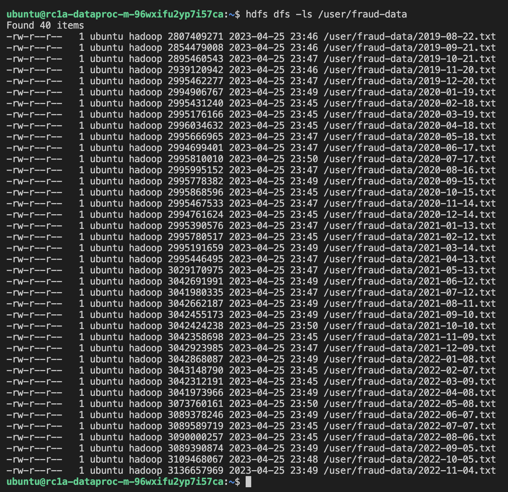

# S3 object storage 
 
Url: [s3://mlops-hw](s3://mlops-hw)

Скрипт для наполнения хранилища:
 ```
#!/bin/bash
for value in `s3cmd ls s3://mlops-data/fraud-data/ | awk '{print $4}'`
do
   name=$(basename ${value})
   s3cmd get $value ./
   s3cmd put ./$name s3://mlops-hw/fraud-data/
   rm ./$name
done
 ```

 # Dataproc кластер

 Listing:
 

 Команда для получения имени хоста DFS:
 ```
 hdfs getconf -confKey fs.defaultFS
 ```

 Команда для закрузки файлов из s3 в dataproc:
 ```
 hadoop distcp \
       -D fs.s3a.bucket.dataproc-examples.endpoint=storage.yandexcloud.net \
       -update \
       -skipcrccheck \
       -numListstatusThreads 10 \
       s3a://mlops-hw/fraud-data \
       hdfs://rc1a-dataproc-m-96wxifu2yp7i57ca.mdb.yandexcloud.net/user/fraud-data/
 ```

# Оценка затрат

Spark кластер в предложенной конфигурации приблизительно в 23 раза дороже чем S3 хранилище.

### Spark кластер

1. s3-c2-m8, 40 Гб ~ RUB 3,601.20
2. s3-c4-m16, 128 Гб ~ RUB 6,623.36 x 3 = RUB 19,870.08

Итого: ~ RUB 23471.28 в месяц

### Object Storage

S3 хранилище на 500 Гб ~ RUB 1,002.98

## Идеи по оптимизации затрат

- Уменьшить количество узлов кластера.
- Уменьшить количество CPU и оперативной памяти на узлах кластера. По крайней мере на время разработки, пока нагрузка будет небольшой.
- Не пользоваться yandex dataproc, а настраивать Spark вручную на Yandex Compute Cloud (судя по детализации, часть расходов идет на Yandex Data Proc)